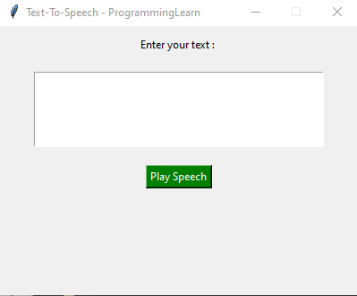

# 🎤 Text-to-Speech App (Python & Tkinter)

A simple **Text-to-Speech (TTS) application** built with Python using `gtts`, `pygame`, and `tkinter`. This app lets you convert text into speech and play the generated audio directly in the GUI.

## 🚀 Features
✔️ Convert text to speech using **Google Text-to-Speech (gTTS)**  
✔️ Play audio directly using **Pygame**  
✔️ User-friendly interface with **Tkinter**  
✔️ Handles errors and empty input  

## 📦 Installation

### 1️⃣ Install Required Libraries
Run the following command to install dependencies:

```
pip install gtts pygame
```


## 🎮 How to Use

1. **Run the script**  
2. **Enter text** in the provided text box  
3. **Click the "Play Speech" button** to hear the audio  

## 🖥️ Screenshot
  

## 📜 Code Overview

- **`textToSpeech()`** – Converts text into speech and plays it  
- **GUI elements** – Tkinter is used for the user interface  
- **Error Handling** – Displays an alert if no text is entered  

## 🔗 Connect with Me
📺 **YouTube:** [ProgrammingLearnPY](https://www.youtube.com/channel/UCmTJ3BqaTs2QN0-zLt3Me1w)  

Enjoy coding! 🚀✨
